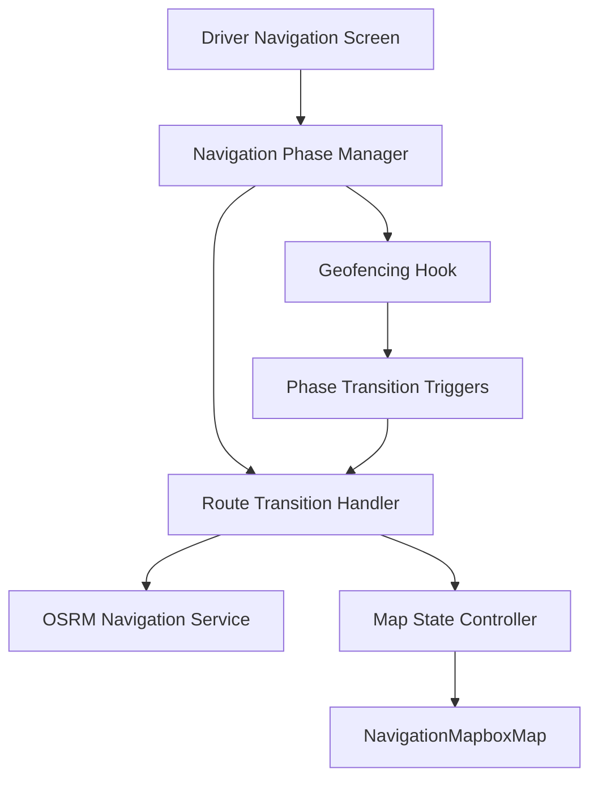

# Design Document

## Overview

This design addresses the driver navigation phase transition issues by implementing a comprehensive state management system that properly handles route clearing, recalculation, and map updates when drivers transition from pickup to destination phases. The solution focuses on clean state transitions, proper resource cleanup, and smooth user experience during navigation phase changes.

## Architecture

### Core Components

1. **Navigation Phase Manager**: Enhanced state management for navigation phases with proper cleanup
2. **Route Transition Handler**: Manages route clearing and recalculation during phase changes
3. **Map State Controller**: Handles map view updates, geofence visibility, and camera transitions
4. **Navigation Service Coordinator**: Coordinates between OSRM navigation service and phase transitions

### Component Interactions



## Components and Interfaces

### Enhanced Navigation Phase Manager

```typescript
interface NavigationPhaseManager {
  currentPhase: NavigationPhase;
  previousPhase: NavigationPhase | null;
  isTransitioning: boolean;
  transitionToPhase: (newPhase: NavigationPhase) => Promise<void>;
  cleanup: () => void;
}

interface PhaseTransitionConfig {
  from: NavigationPhase;
  to: NavigationPhase;
  actions: TransitionAction[];
}

interface TransitionAction {
  type: 'CLEAR_ROUTE' | 'CALCULATE_ROUTE' | 'UPDATE_GEOFENCES' | 'UPDATE_CAMERA' | 'RESTART_NAVIGATION';
  payload?: any;
}
```

### Route Transition Handler

```typescript
interface RouteTransitionHandler {
  clearCurrentRoute: () => void;
  calculateNewRoute: (origin: Coordinates, destination: Coordinates) => Promise<RouteResult>;
  handleTransition: (config: PhaseTransitionConfig) => Promise<void>;
  retryCalculation: (maxRetries: number) => Promise<RouteResult>;
}

interface RouteResult {
  success: boolean;
  route?: NavigationRoute;
  error?: string;
}
```

### Map State Controller

```typescript
interface MapStateController {
  updateGeofenceVisibility: (phase: NavigationPhase) => void;
  transitionCamera: (config: CameraTransitionConfig) => Promise<void>;
  clearMapElements: (elements: MapElement[]) => void;
  resetMapView: () => void;
}

interface CameraTransitionConfig {
  type: 'SHOW_FULL_ROUTE' | 'CENTER_ON_DRIVER' | 'FOLLOW_NAVIGATION';
  coordinates?: Coordinates[];
  duration?: number;
  zoom?: number;
}
```

## Data Models

### Enhanced Navigation Phase

```typescript
type NavigationPhase = 
  | 'to-pickup' 
  | 'at-pickup' 
  | 'picking-up' 
  | 'to-destination' 
  | 'at-destination' 
  | 'completed';

interface NavigationState {
  phase: NavigationPhase;
  previousPhase: NavigationPhase | null;
  isTransitioning: boolean;
  transitionStartTime: number | null;
  routeData: {
    current: NavigationRoute | null;
    previous: NavigationRoute | null;
  };
  mapState: {
    showPickupGeofence: boolean;
    showDestinationGeofence: boolean;
    cameraMode: 'follow' | 'overview' | 'manual';
  };
}
```

### Transition Configuration

```typescript
interface TransitionDefinition {
  id: string;
  from: NavigationPhase;
  to: NavigationPhase;
  actions: {
    preTransition: TransitionAction[];
    duringTransition: TransitionAction[];
    postTransition: TransitionAction[];
  };
  validation: (state: NavigationState) => boolean;
  rollback: TransitionAction[];
}
```

## Error Handling

### Transition Error Recovery

1. **Route Calculation Failures**
   - Implement exponential backoff retry mechanism
   - Fall back to cached route if available
   - Provide manual navigation option as last resort

2. **GPS Signal Loss**
   - Maintain last known position during signal loss
   - Use dead reckoning for short periods
   - Alert driver when signal is restored

3. **Network Connectivity Issues**
   - Cache route data for offline use
   - Queue transition actions for when connectivity returns
   - Provide offline navigation capabilities

### State Consistency

```typescript
interface ErrorRecoveryStrategy {
  detectInconsistentState: (state: NavigationState) => boolean;
  recoverFromError: (error: NavigationError) => Promise<NavigationState>;
  validateTransition: (from: NavigationPhase, to: NavigationPhase) => boolean;
}
```

## Testing Strategy

### Unit Tests

1. **Navigation Phase Manager**
   - Test all valid phase transitions
   - Test invalid transition rejection
   - Test cleanup on component unmount

2. **Route Transition Handler**
   - Test route clearing functionality
   - Test route recalculation with various inputs
   - Test retry mechanism with network failures

3. **Map State Controller**
   - Test geofence visibility updates
   - Test camera transition animations
   - Test map element cleanup

### Integration Tests

1. **End-to-End Phase Transitions**
   - Test complete pickup to destination flow
   - Test error recovery during transitions
   - Test concurrent transition requests

2. **Navigation Service Integration**
   - Test OSRM service restart during transitions
   - Test route data consistency across transitions
   - Test voice guidance continuity

### Performance Tests

1. **Transition Speed**
   - Measure time from phase change trigger to completion
   - Test with various route complexities
   - Test under different network conditions

2. **Memory Management**
   - Test for memory leaks during repeated transitions
   - Test cleanup of navigation resources
   - Test map rendering performance during transitions

## Implementation Approach

### Phase 1: Core Transition Logic
- Implement NavigationPhaseManager with proper state management
- Create RouteTransitionHandler for route lifecycle management
- Add transition validation and error handling

### Phase 2: Map Integration
- Implement MapStateController for geofence and camera management
- Integrate with NavigationMapboxMap component
- Add smooth camera transitions and animations

### Phase 3: Error Recovery
- Implement retry mechanisms for route calculation
- Add offline navigation capabilities
- Create comprehensive error recovery strategies

### Phase 4: Testing and Optimization
- Add comprehensive test coverage
- Optimize transition performance
- Add monitoring and analytics for transition success rates

## Key Design Decisions

1. **Stateful Transition Management**: Use a centralized state manager to track transitions and ensure consistency
2. **Async Transition Handling**: All transitions are asynchronous to handle network operations and animations
3. **Rollback Capability**: Each transition includes rollback actions for error recovery
4. **Separation of Concerns**: Separate route management, map control, and navigation service coordination
5. **Progressive Enhancement**: Graceful degradation when network or GPS services are unavailable